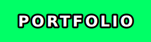
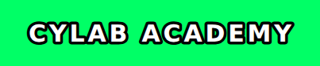
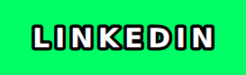

  

  
  
  
  
  

I'm Dave Lazarte, an information security student in the Philippines. I like exploring different things, and I make tools and systems to improve something when I can see a better way to do it.

SOC and blue-team work is the target: Linux, detection, and security testing. Practice stays on TryHackMe, Hack The Box, and CyLab Academy.

Projects and the longer introduction are on the portfolio.

  

